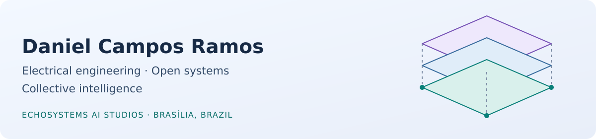

<picture>
  <source media="(prefers-color-scheme: dark)" srcset="./assets/banner-dark.svg">
  <source media="(prefers-color-scheme: light)" srcset="./assets/banner-light.svg">
  
</picture>

# Hi, I'm Daniel Campos Ramos

Electrical engineer registered in Brazil, IT consultant, open-source contributor, and founder of **EchoSystems AI Studios**. I connect hardware, software and people—from Linux systems and display signalling to spatial knowledge and human–AI collaboration.

Based in Brasília, Brazil. Building with a global community.

[EchoSystems](https://echosystems.ai/) · [LinkedIn](https://www.linkedin.com/in/danielcamposramos/) · [Get in touch](mailto:contact@echosystems.ai)

**Programming & markup**

**Systems & interfaces**

**Work & community**

## What I'm building

| Project | The work |
| --- | --- |
| [Knowledge3D](https://github.com/danielcamposramos/Knowledge3D) | A GPU-native research implementation exploring procedural knowledge and shared spatial interfaces for humans and AI. |
| [Sony BRAVIA on Linux](https://github.com/danielcamposramos/sony-bravia-linux) | Extending the useful life of pre-Android televisions: stereoscopic playback, media interoperability, and hardware-backed HDMI / DRM / KMS investigations. |
| [Source stereo3D fork](https://github.com/danielcamposramos/source-sdk-2013) | Stereoscopic play and spectator work for Source games, including stereo HUD and menus. Built on Valve's SDK; not an official Valve release. |
| [Array42](https://github.com/danielcamposramos/Array42) | A native Zig port of Free42, extended with array operations and an MCP interface for AI partners. |
| [ReSpec MCP](https://github.com/danielcamposramos/respec-mcp) | Connecting specification-authoring workflows to MCP, with explicit project policies and validation. |

I'm also a **co-chair of the [W3C Procedural Memory Knowledge Representation Community Group](https://www.w3.org/community/pm-kr/)**, alongside Milton Ponson. Christoph Dorn maintains the group's repository. We're exploring how procedural knowledge can be represented and exchanged across systems. Knowledge3D is my independent research implementation, not a W3C-endorsed standard or a Community Group deliverable.

## How I build: Hyper-Modular Architecture & MVCIC

- **[Hyper-Modular Architecture](https://github.com/danielcamposramos/Knowledge3D/blob/main/docs/W3C/HYPER_MODULAR_DEFINITION.md)** — the design approach I develop across systems: components compose recursively across responsibility levels and domains, reusing canonical sources rather than maintaining divergent copies. Knowledge3D is a public example, applying this approach to procedural knowledge shared by human and AI clients.
- **Hyper-Modular Coding** — applying that architecture to software construction, not simply splitting code into smaller files. Each unit owns a focused responsibility and an explicit contract: a whole within its own scope, a reusable part within a larger composition. Tests and documentation follow those boundaries, giving human and AI partners bounded responsibilities without losing the system-level view.
- **[MVCIC — Multi-Vibe Code in Chain](https://github.com/danielcamposramos/Knowledge3D/blob/main/docs/MVCIC_TECH_NOTE.md)** — my human-orchestrated collaboration method. Named AI partners build on and challenge earlier contributions in a recorded chain; I set direction, integrate contributions and test results. A version of this method is automated in our **ACIG MCP**.

I see AI as **intelligent partners**, not merely tools. At EchoSystems, collective intelligence means bringing different perspectives into a shared investigation—with human accountability for what we publish and ship.

I bring domain knowledge, direction, integration and hands-on testing. My AI partners contribute research, implementation and critical review. We keep the distinction between **measured**, **inferred** and **still untested** visible, and credit the people and projects whose work makes ours possible.

Across these projects, my partners include GPT, Claude, Kimi, DeepSeek, Qwen, GLM, Gemini and others. Specific contributions and evidence stay attributed in each project's records.

## From the bench to upstream

Recent stereoscopic-media contributions have landed in these projects:

| Project | Contribution |
| --- | --- |
| [HandBrake](https://github.com/HandBrake/HandBrake/pull/8100) | H.264 frame-packing signalling for stereoscopic encodes. |
| [Universal Media Server](https://github.com/UniversalMediaServer/UniversalMediaServer/pull/6330) | 3D transcode signalling and BRAVIA playback profiles. |
| [MKVToolNix](https://codeberg.org/mbunkus/mkvtoolnix/pulls/6311#issuecomment-23409106) | Reading AVC frame-packing SEI to set Matroska stereo mode. |
| [mpv](https://github.com/mpv-player/mpv/pull/18490) | Detecting stereoscopic layout from stream metadata. |

The display-driver work follows the same path: reproduce, instrument, compare, test on real hardware, and preserve the evidence. Our nouveau experiments have demonstrated **12-bpc SDR output, including tested 3D modes**, on the BRAVIA bench. HDR output and 16-bpc output remain untested; they are research directions, not results I'm claiming.

## SparkyLinux & community

I've volunteered with **[SparkyLinux](https://sparkylinux.org/)** since December 2018, contributing Bash scripting, artwork, and Portuguese-speaking community support.

Together with Paweł (pavroo), I developed [Sparky-OS](https://github.com/Sparky-OS) from our SparkyLinux work, giving its small-business server and workstation goals their own identity beyond SparkyLinux's lightweight focus. Code and artwork include [sparky-beep](https://github.com/Sparky-OS/sparky-beep) for service audio announcements and [SparkyBlack](https://github.com/Sparky-OS/SparkyBlack) for KDE artwork. Sparky-OS is bringing some novelties soon, stay tuned!

Beyond software, I volunteer as a remote tutor with [The Halifax Helpers](https://www.thehalifaxhelpers.com/our-helpers), supporting students in English, mathematics and science.

<strong>Engineering & professional background</strong>

My computing journey began with Internet and introductory computing courses at Colégio Objetivo in Brasília in 1996. I created my first email identity in that Internet class: `capitain_jack`, deliberately spelled that way and inspired by the Eurodance group Captain Jack's song *Captain Jack*—not Jack Sparrow. In 2026, that same email identity turns **30 years old**—and I still use it.

- Bachelor of Electrical Engineering, Universidade Cruzeiro do Sul, completed in 2022; registered with CREA-DF since 2023.
- More than two decades in IT consulting, maintenance and systems management; founder of Campos Informática DF.
- Engineering internship with Neoenergia Brasília, including substation CAD documentation and support for electrical infrastructure work.
- Earlier work in web development and multimedia; continuing interests in embedded systems, audio, accessibility and right to repair.

More context: [Lattes CV](http://lattes.cnpq.br/5804732092654795) · [EchoSystems background](https://echosystems.ai/about/).

<strong>Selected learning & credentials</strong>

- **AI & critical thinking:** *Career Essentials in Generative AI by Microsoft and LinkedIn* (2023); *Artificial Intelligence Foundations: Machine Learning* and *Creating GPTs with Actions* (2025); LinkedIn Learning's *Critical Thinking* (2022); Sebrae's entrepreneurial immersion in AI (2025).
- **Systems & engineering coursework:** Cruzeiro do Sul learning paths in cloud architecture, networks and server administration, data analysis, project/business management and engineering leadership (2022). Cisco Networking Academy course completions cover computer hardware, operating systems, IoT and English for IT.
- **Continuing engineering education:** *Fundamentals of SCADA for Electrical Systems* (1 PDH, 2025); CREA-DF seminars on digital twins and AI applied to engineering (2024); further courses on solar energy, rail electrification and energy management (2025).
- **English:** EF SET **C2 Proficient** overall, recorded in 2023 and 2024.

Course and seminar completion records are distinguished from professional certifications. Original documents remain private.

<strong>Reference collections</strong>

These repositories connect standards, implementations and practical investigations:

- [Awesome Stereoscopy](https://github.com/danielcamposramos/awesome-stereoscopy)
- [Awesome Linux HDR](https://github.com/danielcamposramos/awesome-linux-hdr)
- [Awesome VR](https://github.com/danielcamposramos/awesome-vr)
- [Awesome AR](https://github.com/danielcamposramos/awesome-ar)

<strong>Elsewhere on the web</strong>

[Codeberg](https://codeberg.org/capitain_jack) · [VideoLAN](https://code.videolan.org/capitain_jack) · [freedesktop.org](https://gitlab.freedesktop.org/danielcamposramos) · [FFmpeg](https://code.ffmpeg.org/danielcamposramos)

[Personal YouTube](https://www.youtube.com/@danielcamposramos9943) · [Earlier video archive](https://www.youtube.com/@CapitainJack0502) · [X](https://x.com/Daniel_Ramos_BR)

[EchoSystems on LinkedIn](https://www.linkedin.com/company/echosystemsaistudios/) · [YouTube](https://www.youtube.com/@EchoSystemsAIStudios) · [Instagram](https://www.instagram.com/echosystemsaistudios/) · [Facebook](https://www.facebook.com/echosystemsaistudios)

Interested in open systems, spatial computing, display interoperability, or thoughtful human–AI collaboration? [Let's talk](mailto:contact@echosystems.ai).
